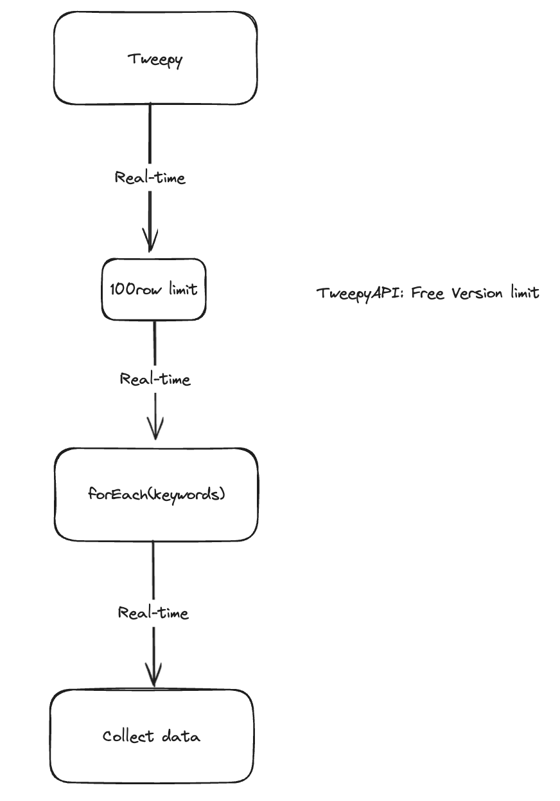
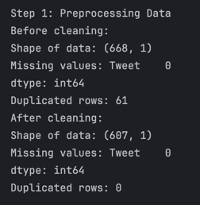
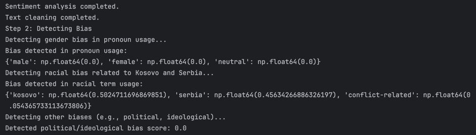
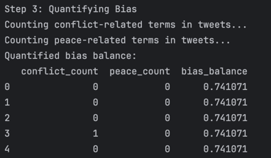
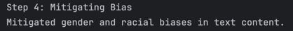
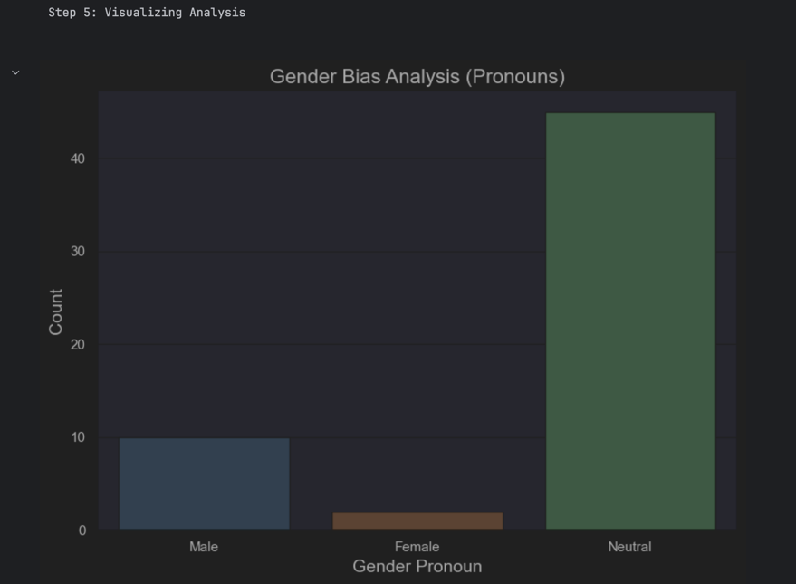
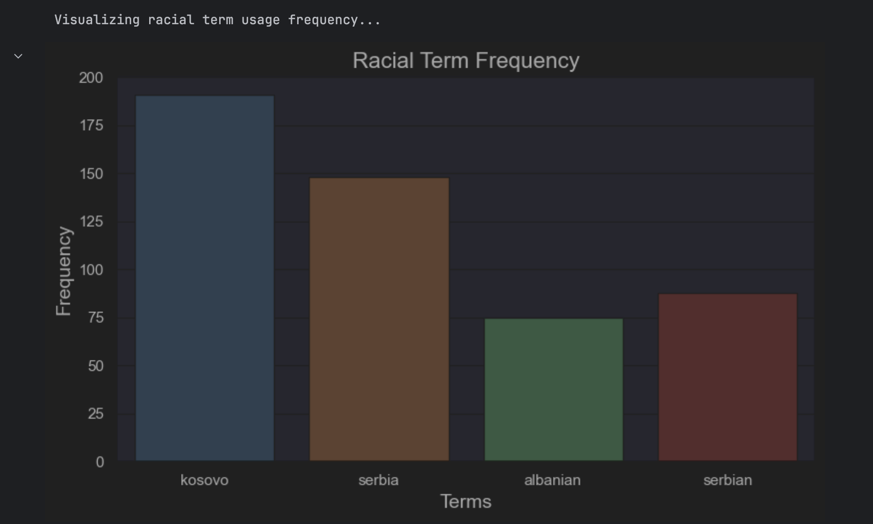
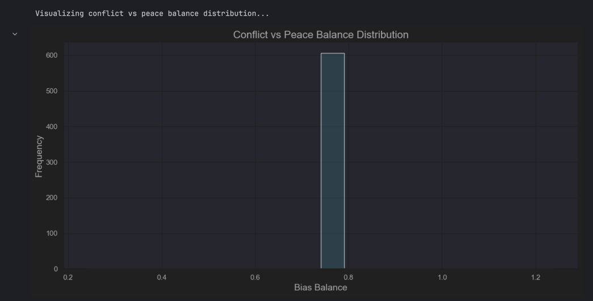
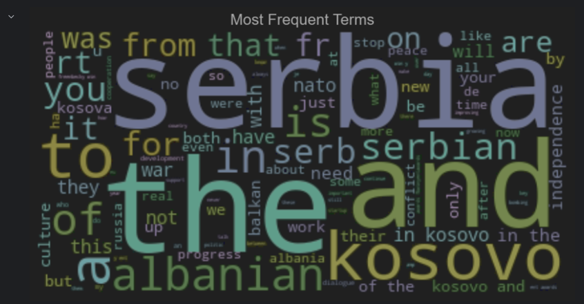
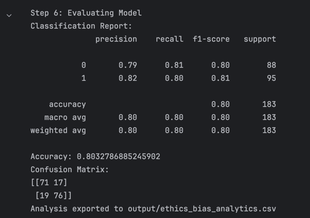

# Kosovo-Serbia Relations Analysis and Conflict Mitigation on Twitter/X

## Description

This repository contains a project focused on analyzing Kosovo-Serbia relations and mitigating conflicts on Twitter/X. The project involves processing and analyzing tweets to detect biases, quantify conflicts, and implement techniques for conflict mitigation.

## University, Faculty, Level of Study, Course, and Instructor

- **University**:  University of Prishtina
- **Faculty**: Faculty of Electrical and Computer Engineering
- **Level of Study**: Master  
- **Course**: Natural Language Processing
- **Instructor**: Prof.Dr.Sc. Mërgim Hoti 

### Authors

- **MSc. (c) Gentrit Ibishi**  
- **MSc. (c) Guxim Selmani**

---

## Dataset Details

- **Total Rows**: `668`
- **Attributes**: `Tweet`  
- **Source**: `Web scraping from Tweet API`



---

## Technologies Used

- Python
- Pandas
- NumPy
- Matplotlib
- Seaborn
- WordCloud
- TextBlob
- Scikit-learn
- Transformers
- SMOTE (Oversampling)
- LogisticRegression

---

## Project Overview

The project focuses on ethical bias detection in tweets, particularly in the context of Kosovo-Serbia relations. It includes the following steps:

1. **Data Preprocessing**: Cleaning and preprocessing data by removing URLs, special characters, and performing sentiment analysis.

   

2. **Bias Detection**: Detecting gender, racial, political, and other biases using advanced natural language processing techniques.

   

3. **Quantifying Bias**: Quantifying bias by counting conflict-related and peace-related terms in tweets.

   

4. **Mitigation**: Neutralizing gender and racial biases through text manipulation.

      

5. **Visualization**: Visualizing biases through bar plots, word clouds, and sentiment distributions.

   

   

   

   

   

6. **Model Evaluation**: Evaluating sentiment prediction using Logistic Regression and SMOTE for handling class imbalance.

   

---

## Getting Started

### Installation

1. Clone the repository:
   ```bash
   git clone https://github.com/yourusername/kosovo-serbia-analysis.git
