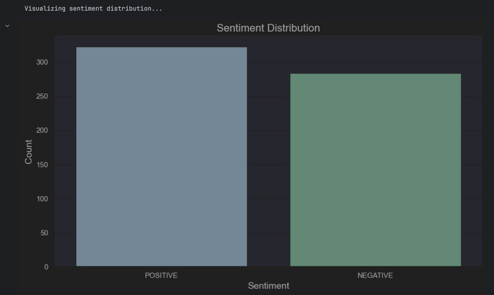

# Ethical Bias Detection in Kosovo-Serbia Relations Analysis and Conflict Mitigation on Twitter/X

## Description

This repository contains a project focused on analyzing Kosovo-Serbia relations and mitigating conflicts on Twitter/X. The project involves collecting data, processing and analyzing tweets to detect biases, quantify conflicts, and implement techniques for conflict mitigation.

## University, Faculty, Level of Study, Course, and Instructor

- **University**:  University of Prishtina
- **Faculty**: Faculty of Electrical and Computer Engineering
- **Level of Study**: Master  
- **Course**: Natural Language Processing
- **Instructor**: Prof.Dr.Sc. Mërgim Hoti 

### Authors

- **MSc. (c) Gentrit Ibishi**  
- **MSc. (c) Guxim Selmani**

---

## Dataset Details

- **Total Rows**: `668`
- **Attributes**: `Tweet`  
- **Source**: `Web scraping from Tweet API`


---

## Technologies Used

- Python
- Pandas
- NumPy
- Matplotlib
- Seaborn
- WordCloud
- TextBlob
- Scikit-learn
- Transformers
- SMOTE (Oversampling)
- LogisticRegression

---

## Project Overview

This project implements a NLP-based system for analyzing and mitigating biases in social media discourse surrounding Kosovo-Serbia relations. The system processes Twitter data to detect various forms of bias, quantify conflicts, and implement conflict mitigation strategies through advanced natural language processing techniques. It includes the following steps:

1. **Data Collection**: The project uses a robust Twitter data collection system implemented in tweepy_api.ipynb including key features like:
   
   *Multiple bearer token support for extended rate limits
   *Automatic rate limit handling with wait periods
   *Batch processing to prevent memory overload
   *Error handling and retry mechanisms
   ```
   # Twitter API configuration
BEARER_TOKENS = [
    "TOKEN1",
    "TOKEN2",
    "TOKEN3"
]

# Configurable query parameters
queries = [
    '(Conflict Kosovo OR Conflict Serbia OR RKS OR SRB) lang:en -is:retweet'
]
    ```
    
2. **Data Preprocessing**: Cleaning and preprocessing data by removing URLs, special characters, and performing sentiment analysis.

   

3. **Bias Detection**: Detecting gender, racial, political, and other biases using advanced natural language processing techniques.

   

4. **Quantifying Bias**: Quantifying bias by counting conflict-related and peace-related terms in tweets.

   

5. **Mitigation**: Neutralizing gender and racial biases through text manipulation.

      

6. **Visualization**: Visualizing biases through bar plots, word clouds, and sentiment distributions.

   

   

   

   

   

7. **Model Evaluation**: Evaluating sentiment prediction using Logistic Regression and SMOTE for handling class imbalance.

   

---

## Getting Started

### Installation

1. Clone the repository:
   ```bash
   git clone https://github.com/yourusername/kosovo-serbia-analysis.git
